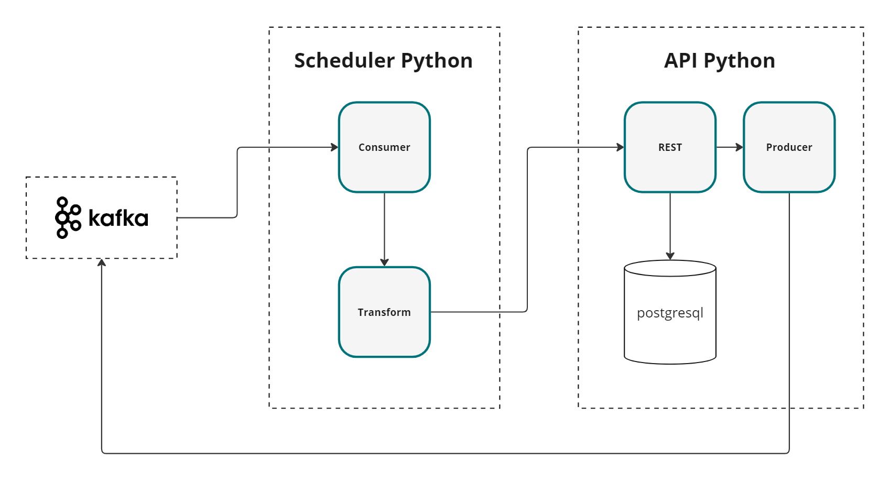

# Fluxo de Dados
Sistema distribuído que realiza o consumo, transformação, persistência e produção de dados

# Aplicação
Sistema distribuído que realiza o consumo, transformação, persistência e produção de dados utilizando Kafka, Python e PostgreSQL. O sistema é composto por duas aplicações distintas:

1. Responsável por consumir dados do Kafka, realizar a transformação e enviar os dados transformados via um endpoint REST.
2. API Python: Responsável por receber os dados transformados via o endpoint, persistir no banco de dados PostgreSQL e produzir os dados no Kafka.

Os tópicos do Kafka, que estão no `.env`, são criados na primeira chamada no fluxo da aplicação. A tabela do Banco é criada automaticamente via ORM.


# Como Executar & Testar

- 1. `docker compose up -d`
- 2. Produzir manualmente a Mensagem via webkafka `http://localhost:9030/` ou via endpoint `curl --location 'http://localhost:8000/produto/manual' \
--header 'Content-Type: application/json' \
--header 'Authorization: ••••••' \
--data '{
  "productId": "12369",
  "productName": "Nome do Produto",
  "productDescription": "Descrição do Produto",
  "price": 100.0,
  "currency": "BRL",
  "stockQuantity": 50,
  "category": "Categoria do Produto"
}'`. Podendo ser testado tambémm via Postman ou similar.
- 3. Verificar o fluxo da aplicação:
  * 3.1. Navegar no Webkafka `http://localhost:9030/`: ver as mensagens persistidas em cada tópico Kafka da aplicação.
  * 3.2. Nos Logs dos containers:
      ```bash
      docker logs -f fluxo-dados-api-1
      docker logs -f fluxo-dados-scheduler-1
      ```
  * 3.3. No Banco de Dados, na tabela `produtcs`, verificar os dados persistidos que chegaram via Scheduler.
<div style="text-align: center;">
</div>

# Outros

http://127.0.0.1:8000/docs

http://127.0.0.1:8010/docs